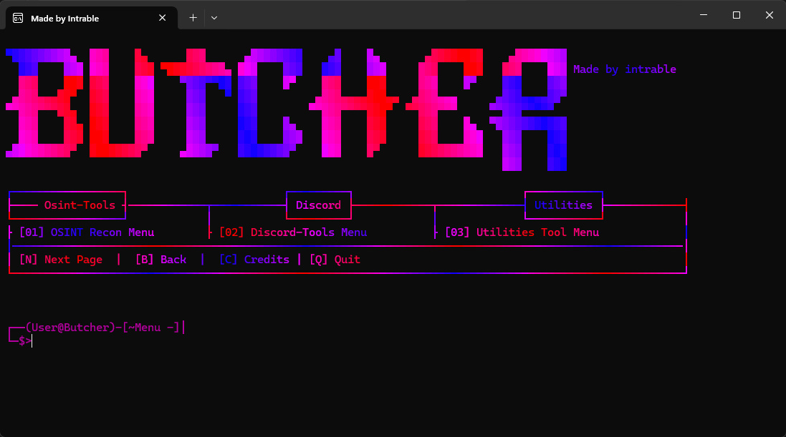
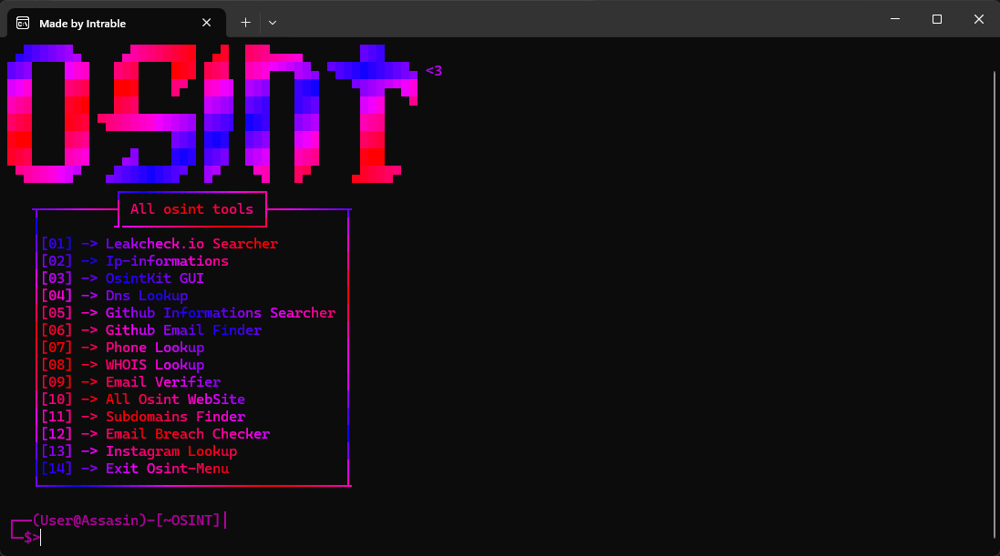
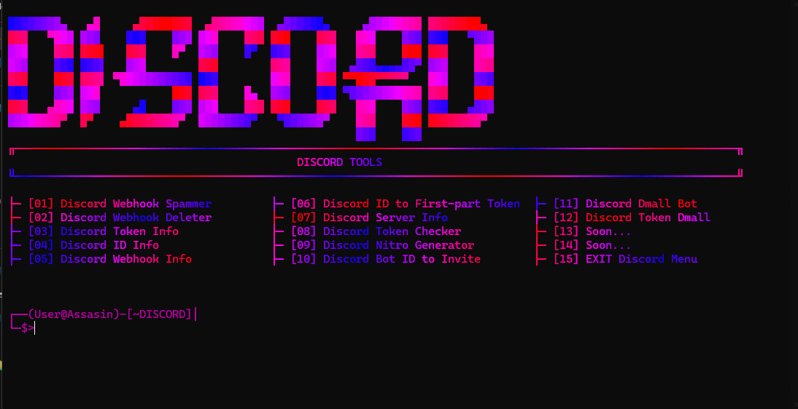

# 🚨 Butcher-Tools 🚨

> **All-in-One OSINT & Automation Toolkit**  
> 35+ powerful features for OSINT, Discord automation, utilities, and more — all in one clean, intuitive interface.

---

## 🔥 Features

- 🛠️ **OSINT Tools**  
  Comprehensive reconnaissance and intelligence-gathering modules to assist cyber investigators.

- 💬 **Discord Tools**  
  Automation, moderation, token management, webhook spam, and other Discord utilities.

- 🔧 **Utility Tools**  
  Handy scripts and general-purpose utilities for power users.

- 🖥️ **GUI & CLI**  
  Friendly graphical user interface plus command-line options for flexible use.

- 📦 **And More...**  
  Continuous development with regular updates and new tools being added.

---

## 🛠️ Butcher-Tools Options

### OSINT Tools

- Leakcheck.io Searcher  
- IP Information Lookup  
- OSINTKit GUI Interface  
- DNS Lookup  
- GitHub Information Searcher  
- Phone Number Lookup  
- WHOIS Lookup  
- Email Verifier  
- All OSINT Websites Collection  
- Instagram Lookup  
- Genderize.io (Name to Gender)  

### Discord Tools

- Discord Webhook Spammer  
- Discord Webhook Deleter  
- Discord Token Info  
- Discord ID Info  
- Discord Webhook Info  
- Discord ID to First-part Token  
- Discord Server Info  
- Discord Token Checker  
- Discord Nitro Generator  
- Discord Bot ID to Invite  
- Discord Token DM All  
- Coming Soon...  

### Utility Tools

- (Under development, coming soon)

---

## 📅 Release Info

Butcher-Tools is under active development.  
The first stable release with OSINT and Discord tools is available!  
⭐ Please star this repo and follow for updates.

---

## 📸 Screenshots

<div align="center">

## 📸 Screenshots

<div align="center">

| Main Menu                               | OSINT Tools Menu                          | Discord Tools Menu                      |
|----------------------------------------|------------------------------------------|---------------------------------------|
|   |   |  |

</div>

---

## 📦 Installation

### Requirements

- Python 3.8 or higher installed  
- Windows 10/11 or recent Linux distribution

### Instructions

```bash
git clone https://github.com/stegman-ux/Butcher-Tools.git
cd Butcher-Tools
python setup.py
python butcher.py
```

⚠️ Disclaimer
Butcher-Tools is developed for educational purposes only.
Users take full responsibility for their actions.
Any illegal or malicious use is strictly prohibited.

📄 License
This project is licensed under GNU GPLv3 — see the LICENSE file for details.

💬 Contact & Contributions
Feel free to contribute or suggest improvements!
Follow the project on GitHub: https://github.com/stegman-ux/Butcher-Tools

Made with ❤️ by Butcher Team
